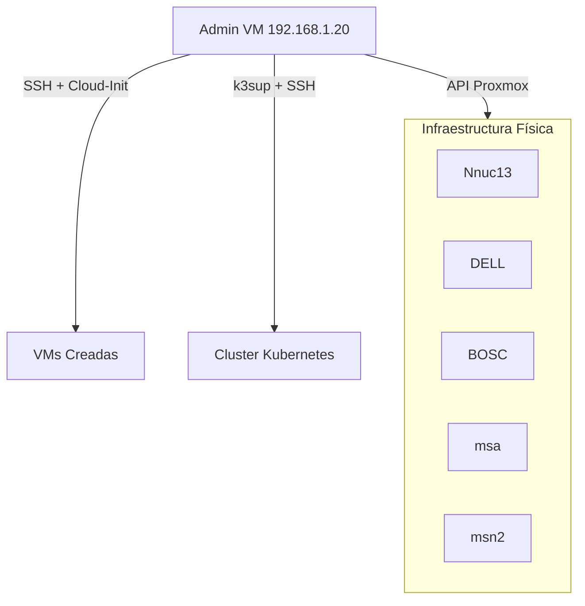

Este proueto llamado 


```text
 _  ___   _ ____  _____      ____  _   _ ___ _     ____  _____ ____
| |/ / | | | __ )| ____|    | __ )| | | |_ _| |   |  _ \| ____|  _ \
| ' /| | | |  _ \|  _|_____ |  _ \| | | || || |   | | | |  _| | |_) |
| . \| |_| | |_) | |__|_____| |_) | |_| || || |___| |_| | |___|  _ <
| . \| |_| | |_) | |__|_____| |_) | |_| || || |___| |_| | |___|  _ <
|_|\_\\___/|____/|_____|    |____/ \___/|___|_____|____/|_____|_| \_\
```
Es una serie de herramientas a-la "Infrestructura as Menu" para crear desde cero un cluster de Kubernetes K3s

Para lograr el objetivo, los utilitarios de este proyecto, hacen primero un setup guidado de  toda la infreastrcutura desde un lanzador ./launch.sh


**Automated Infrastructure & Kubernetes Cluster Manager**

Esta herramienta ha evolucionado de una colección de scripts a una **aplicación de gestión centralizada** que corre en una Admin VM dedicada (`192.168.1.20`). Permite desplegar infraestructura en Proxmox y clusters Kubernetes (K3s) de alta disponibilidad con un solo comando.

---

## 🚀 Inicio Rápido (Workflow Diario)

Todo se gestiona desde la **Admin VM**. No necesitas ejecutar scripts sueltos.

### 1. Acceder al Panel de Control

Conéctate a la Admin VM y ejecuta el lanzador:

```bash
ssh rwagner@192.168.1.20
./launch.sh
```

### 2. Menú Principal

El sistema te presentará un menú interactivo:

*   **1. 🖥️  Crear VMs**: Despliega servidores basándose en `vms.yaml` y el Plan de IPs.
*   **8. 🗑️  BORRAR Todas las VMs**: Limpieza total para empezar de cero.
*   **9. ☸️  Desplegar Cluster K3s (HA)**:
    *   Bootstrapping del primer Master.
    *   Instalación de VIP (Kube-VIP) para Alta Disponibilidad.
    *   Unión automática de Masters y Workers restantes.
*   **10. 📊 Ver Estatus Cluster**: Muestra una tabla con la ubicación física (Nodo Proxmox) de cada servicio K3s.
*   **11. 🚀 Iniciar Cluster**: Levanta los servicios ordenadamente (Masters -> Workers).
*   **12. 🛑 Detener Cluster**: Detiene los servicios ordenadamente (Workers -> Masters).
*   **13. 🌙 Apagar VMs**: Apagado ordenado (ACPI) seleccionando VMs específicas.
*   **14. 🪄  Configuración**: Asistente para configurar IPs y credenciales fácilmente.

---

## 🏗️ Arquitectura

El sistema opera bajo un modelo de **Controlador Central**:



### Componentes Clave

1.  **Librería Compartida (`lib/`)**:
    *   `config.py`: Gestión centralizada de configuración e IPs.
    *   `proxmox_client.py`: Abstracción de la API de Proxmox.
    *   `k3s_manager.py`: Lógica de orquestación de Kubernetes.
    *   `setup_wizard.py`: Interfaz de configuración interactiva.

2.  **Configuración (`config.yaml`)**:
    *   Define el **Plan de IPs** (qué IP toca a cada Master/Worker).
    *   Configuración de red global (Gateway, DNS).
    *   Parámetros del Cluster K3s (VIP, Interface, Token).

3.  **Definición de VMs (`vms.yaml`)**:
    *   Define los recursos físicos (CPU, RAM, Disco) y la ubicación (Nodo Proxmox).
    *   **Nota:** Ya no contiene IPs fijas; estas se asignan dinámicamente desde `config.yaml`.

---

## ⚙️ Configuración

### `config.yaml` (Ejemplo)

```yaml
network:
  gateway: "192.168.1.1"
  dns: "8.8.8.8"

ip_plan:
  masters:
    - "192.168.1.21"
    - "192.168.1.22"
    - "192.168.1.23"
  workers:
    - "192.168.1.24"
    - "192.168.1.25"
    - "192.168.1.26"
    - "192.168.1.27"
    - "192.168.1.28"

k3s:
  vip: "192.168.1.50"
  interface: "ens18"  # ¡CRÍTICO! Debe coincidir con la interfaz de la VM
```

### `vms.yaml` (Ejemplo)

```yaml
vms:
  - vmid: 3001
    name: "k3s-master-01"  # El nombre debe contener 'master' o 'worker' para asignación de IP
    node: "DELL"
    template: "medium"
```

---

## 🛠️ Resolución de Problemas

### Conectividad con Admin VM
Si pierdes acceso a `192.168.1.20`:
1.  Entra a la consola de Proxmox.
2.  Ejecuta `ip addr` para verificar la IP.
3.  Si la IP es correcta pero no responde al ping, limpia tu tabla ARP local:
    ```bash
    sudo arp -d 192.168.1.20
    ```

### El Cluster K3s no inicia
1.  Usa la **Opción 10 (Estatus)** para ver qué nodos están caídos.
2.  Verifica que la interfaz de red en `config.yaml` (`k3s.interface`) sea correcta (usualmente `ens18` o `eth0`).
3.  Intenta un reinicio forzado del cluster con la **Opción 11**.

---

## 📝 Changelog v4.0

*   **Migración a Admin VM**: Todo el código vive ahora en un entorno estable y dedicado.
*   **Menú Unificado**: Se eliminaron los scripts sueltos (`create_vm.py`, etc) en favor de una TUI (`main.py`).
*   **Gestión K3s Integrada**: Despliegue, Parada e Inicio de clusters directamente desde la herramienta.
*   **IPs Dinámicas**: Separación de la infraestructura (`vms.yaml`) de la red (`ip_plan` en `config.yaml`).
*   **Visibilidad de Nodos**: Nueva función para ver en qué servidor físico reside cada nodo del cluster.
